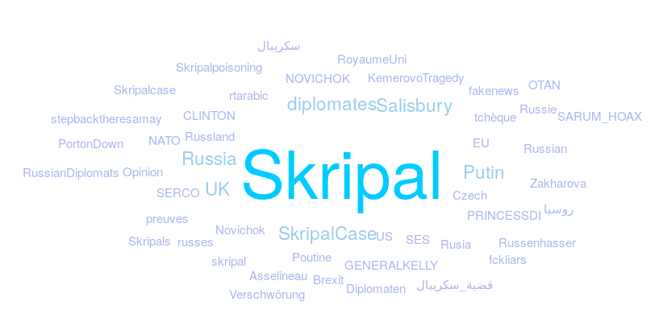

# TwitterReports

This is a tool that tells you things from twitter data

# Data crawling
## Streaming
Use twitter streaming api to collect tweets about hashtags, etc.

## Historical
Use Twarc to collect historical data about tweets posted in the past.
Link: [https://github.com/docnow/twarc)](https://github.com/docnow/twarc)

**Example**:

twarc search 'Novichok OR skripal OR سكريبال OR قضية_سكريبال' > skripal_tweets.jsonl

# Data Analytics
## Most frequent things: Hashtags, mentions, urls, etc.

Run the following code: 

`python frequent_things.py skripal_tweets.jsonl`

Several files will be created under data/:

* most_common_hashtags.txt: most frequently used hashtags
* most_common_locations.txt: most frequent locations from user profiles.
* most_common_photos.txt: most shared images
* most_common_users.txt: most prominent users (those who tweeted the most)
* most_common_links.txt: most shared links     
* most_common_mentions.txt: most mentioned users in tweets
* most_common_retweets.txt: most retweeted tweets. 


## Timeline of Twitter volume:

Run the following code:

`python volume.py skripal_tweets.jsonl hourly`

You can replace *hourly* by *daily*

The output is something like: 
```
2018-03-27 18,105
2018-03-27 19,1559
2018-03-27 20,1598
2018-03-27 21,1546
2018-03-27 22,1115
2018-03-27 23,795
2018-03-28 00,773
2018-03-28 01,622
2018-03-28 02,555
2018-03-28 03,603
2018-03-28 04,670
2018-03-28 05,59
```

## Hashtags:
There's a code to generate data for the clouds.
1. Run the following code:

`python generate_cloud_data.py skripal_tweets.jsonl 50`

Where 50 is the number of hashtags you want to generate. 
The output is the  most frequent hashtags with their weights per day. 

```
=================== 2018-03-27
{text: "Skripal", weight: 1364},
{text: "Russia", weight: 228},
{text: "SkripalCase", weight: 174},
{text: "Putin", weight: 169},
{text: "Salisbury", weight: 128},
{text: "diplomates", weight: 125},
{text: "UK", weight: 107},
{text: "Novichok", weight: 87},
{text: "SES", weight: 73},
{text: "EU", weight: 72},
=================== 2018-03-28
{text: "Skripal", weight: 626},
{text: "Russia", weight: 175},
{text: "UK", weight: 150},
{text: "Rusia", weight: 73},
{text: "Czech", weight: 70},
{text: "Putin", weight: 63},
{text: "Skripals", weight: 39},
{text: "Novichok", weight: 38},
{text: "Salisbury", weight: 31},
{text: "SARUM_HOAX", weight: 24},
```
2. Copy past the hashtags of one day, say 2018-03-27, into `word_array` in `clouds.html`

3. Run: `firefox clouds.html` and make a screenshot of the beautiful output.



